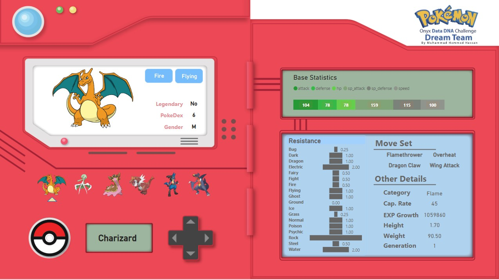

# DataDNA Challenge - July 2022

> Challenge Official Page can be found [here](https://onyxdata.co.uk/dataset_challenge/july-2022)

They gave us a **Pokemon dataset** our objective was to bring forth a **dream team** of 6 pokemons with 2 condition:

> 1. A Team which will deal the **most damage**.
> 2. A Team which will **remain relatively impervious** to any other team of 6 fully trained pokemons

Although the first condition was easy, the latter was tough and gave me a hard time figuring out the type balancing. But here I am with my **Data Visualization** made in **PowerBI**. You can take a look at the dataset [here on Kaggle](https://www.kaggle.com/datasets/kartikkadian/pokemondata).

> **Note:** The pictures I used were from [kindpng.com](https://www.kindpng.com/). All other images and background wallpaper was made by me in Adobe Illustrator.(yeah desiging is my hobby)

# Submission Preview

Here is my submission post on [LinkedIn](https://www.linkedin.com/posts/muhammad-hammad-hassan-cs101_datadna-july2022-pokemon-activity-6957400293147848704-zqjK?utm_source=linkedin_share&utm_medium=member_desktop_web)
